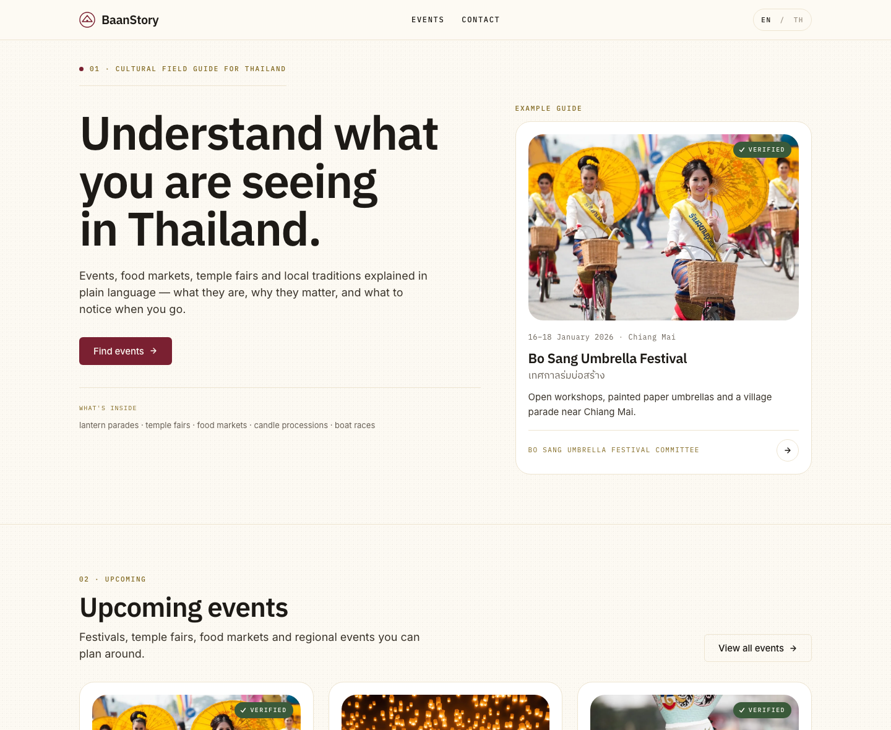

# BaanStory

BaanStory is a web-first cultural guide for Thai craft events and traditions that helps visitors understand what they are seeing, why it matters, and what to notice when they go.

Live demo: [baanstory.com](https://baanstory.com/)



## The problem

Thai craft events, festivals, and local traditions are hard to discover and even harder to understand if you are not already inside the local context. Information is scattered across sources, often untranslated, and usually presented as basic event facts without enough cultural explanation to help a visitor decide whether the experience is worth their time.

## What BaanStory does

BaanStory turns real Thai festivals, fairs, and local traditions into source-backed, bilingual cultural explanations. The goal is not just to say that an event exists, but to explain what it is, why it matters, what to notice when you arrive, and how to approach it respectfully.

## What this hackathon demo includes

- A landing page that introduces the concept and current sample events
- An events listing page
- Event detail pages for the current dataset
- A contact page for organisers, partners, and corrections
- Bilingual English/Thai UI
- Six event cards in the current demo dataset
- Source-backed framing with explicit gaps where information is still unconfirmed
- Shareable event links within the demo

## How to run locally

This public repository is a static frontend demo. There is no build step.

1. Clone the repository:

```bash
git clone https://github.com/avechri/baanstory.git
cd baanstory
```

2. Start a local static server:

```bash
python3 -m http.server 8000
```

3. Open `http://localhost:8000` in your browser.

Notes:

- No package install is required for the public demo.
- An internet connection is needed because the project loads Google Fonts and React/Babel from CDNs.

## Project structure

- `index.html`, `app.jsx`, `components.jsx`, `pages.jsx`, `data.js`, `styles.css`: static frontend demo
- `assets/`: event images used in the current public demo
- `screenshots/`: demo screenshots
- `uploads/`: imported product and design context docs used during the hackathon

## AI collaboration

This project used AI tools during the hackathon.

- The public demo/site was assembled with Claude Design assistance.
- Documentation and this README were prepared with Codex.
- Deployment and repo operations were handled with Codex.
- Commit history is the main collaboration proof; this README is supporting context.

## Current status

This is an event-first hackathon demo, not a marketplace, booking system, or finished production stack. The public repo focuses on the demo experience and supporting submission materials, not the full internal documentation and data backbone used during development.

## Supporting docs

If you want deeper product context behind the demo, start with [uploads/current-frame.md](uploads/current-frame.md), [uploads/mvp-scope-p0.md](uploads/mvp-scope-p0.md), and [uploads/design-spec.md](uploads/design-spec.md).
